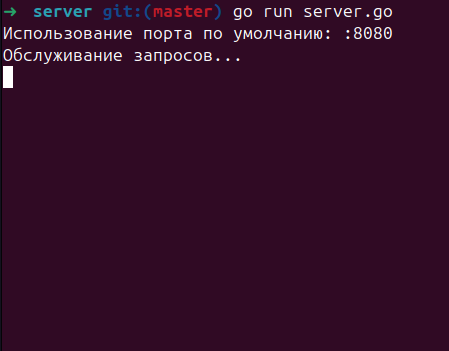
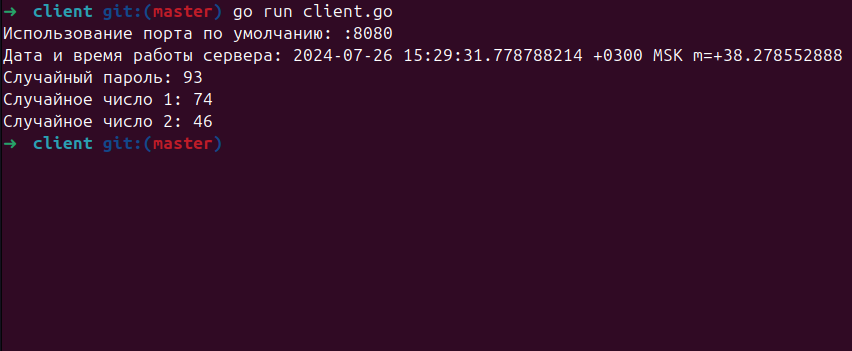

# Пример go gRPC

## Запуск локально

```
git clone https://github.com/MiCkEyZzZ/gogrpc
cd server
go run server.go
cd client
go run client.go
```

## Результат после исполнения

<p align="left">
  
</p>
</br>

<p align="left">
  
</p>
</br>
